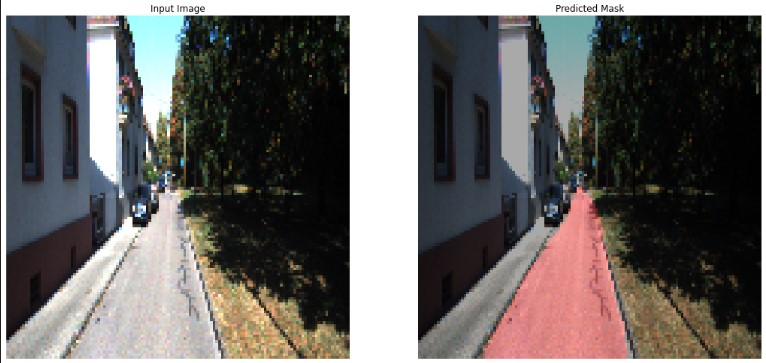
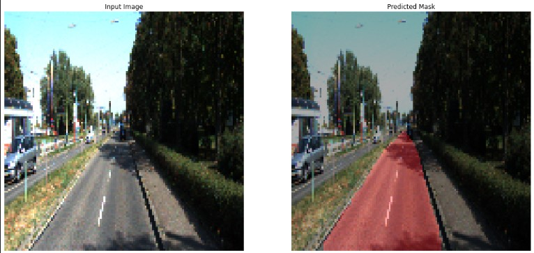
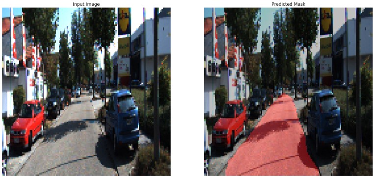
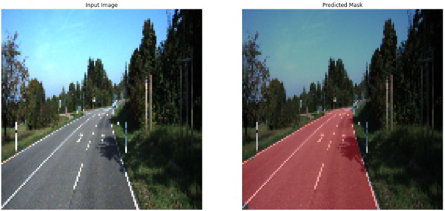

# Road Segmentation using FCN (Fully Convolutional Networks)

In this small project, I created a `road segmentation` model using `FCN` for `self-driving` cars. This uses the `VGG16 model` as the backend, which is pretrained on the `ImageNet` dataset with the last pooling layers modified to implement road segmentation tp create a more granular `FCN8` architecture. The model was built using `TensorFlow` with `GPU` acceleration on Kaggle Notebooks. The model contains around `14 Million parameters`, trained for `200 epochs`.

</br>

# Dataset 💿
The datatset used to train the model is the `KITTI Vision Dataset`. The link to the dataset is https://www.cvlibs.net/datasets/kitti/eval_road.php

</br>

# Model Architecture ⬇

```
Model: "VGG_FCN8"
__________________________________________________________________________________________________
Layer (type)                    Output Shape         Param #     Connected to                     
==================================================================================================
input_2 (InputLayer)            [(None, 128, 128, 3) 0                                            
__________________________________________________________________________________________________
block1_conv1 (Conv2D)           (None, 128, 128, 64) 1792        input_2[0][0]                    
__________________________________________________________________________________________________
block1_conv2 (Conv2D)           (None, 128, 128, 64) 36928       block1_conv1[0][0]               
__________________________________________________________________________________________________
block1_pool (MaxPooling2D)      (None, 64, 64, 64)   0           block1_conv2[0][0]               
__________________________________________________________________________________________________
block2_conv1 (Conv2D)           (None, 64, 64, 128)  73856       block1_pool[0][0]                
__________________________________________________________________________________________________
block2_conv2 (Conv2D)           (None, 64, 64, 128)  147584      block2_conv1[0][0]               
__________________________________________________________________________________________________
block2_pool (MaxPooling2D)      (None, 32, 32, 128)  0           block2_conv2[0][0]               
__________________________________________________________________________________________________
block3_conv1 (Conv2D)           (None, 32, 32, 256)  295168      block2_pool[0][0]                
__________________________________________________________________________________________________
block3_conv2 (Conv2D)           (None, 32, 32, 256)  590080      block3_conv1[0][0]               
__________________________________________________________________________________________________
block3_conv3 (Conv2D)           (None, 32, 32, 256)  590080      block3_conv2[0][0]               
__________________________________________________________________________________________________
block3_pool (MaxPooling2D)      (None, 16, 16, 256)  0           block3_conv3[0][0]               
__________________________________________________________________________________________________
block4_conv1 (Conv2D)           (None, 16, 16, 512)  1180160     block3_pool[0][0]                
__________________________________________________________________________________________________
block4_conv2 (Conv2D)           (None, 16, 16, 512)  2359808     block4_conv1[0][0]               
__________________________________________________________________________________________________
block4_conv3 (Conv2D)           (None, 16, 16, 512)  2359808     block4_conv2[0][0]               
__________________________________________________________________________________________________
block4_pool (MaxPooling2D)      (None, 8, 8, 512)    0           block4_conv3[0][0]               
__________________________________________________________________________________________________
block5_conv1 (Conv2D)           (None, 8, 8, 512)    2359808     block4_pool[0][0]                
__________________________________________________________________________________________________
block5_conv2 (Conv2D)           (None, 8, 8, 512)    2359808     block5_conv1[0][0]               
__________________________________________________________________________________________________
block5_conv3 (Conv2D)           (None, 8, 8, 512)    2359808     block5_conv2[0][0]               
__________________________________________________________________________________________________
block5_pool (MaxPooling2D)      (None, 4, 4, 512)    0           block5_conv3[0][0]               
__________________________________________________________________________________________________
up_sampling2d (UpSampling2D)    (None, 8, 8, 512)    0           block5_pool[0][0]                
__________________________________________________________________________________________________
concatenate (Concatenate)       (None, 8, 8, 1024)   0           up_sampling2d[0][0]              
                                                                 block4_pool[0][0]                
__________________________________________________________________________________________________
up_sampling2d_1 (UpSampling2D)  (None, 16, 16, 1024) 0           concatenate[0][0]                
__________________________________________________________________________________________________
concatenate_1 (Concatenate)     (None, 16, 16, 1280) 0           up_sampling2d_1[0][0]            
                                                                 block3_pool[0][0]                
__________________________________________________________________________________________________
up_sampling2d_2 (UpSampling2D)  (None, 128, 128, 128 0           concatenate_1[0][0]              
__________________________________________________________________________________________________
conv2d (Conv2D)                 (None, 128, 128, 1)  1281        up_sampling2d_2[0][0]            
==================================================================================================
Total params: 14,715,969
Trainable params: 14,715,969
Non-trainable params: 0
```
</br>

# Results 🏁

Here are some samples from the prediction of the trained model


</br></br>

</br></br>

</br></br>
